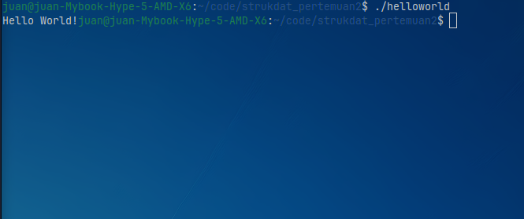
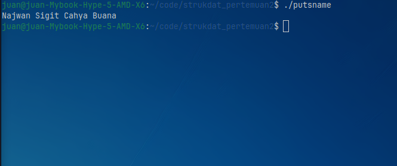
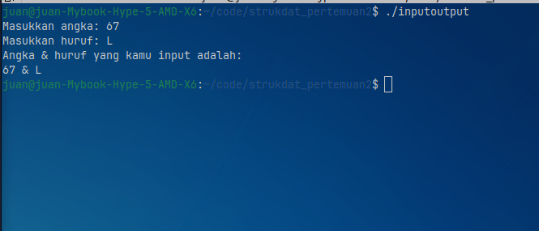
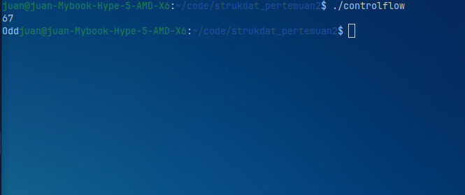
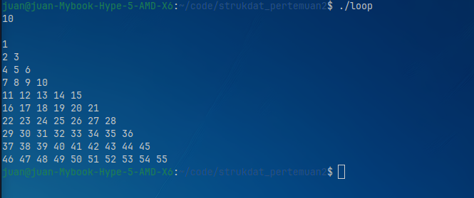
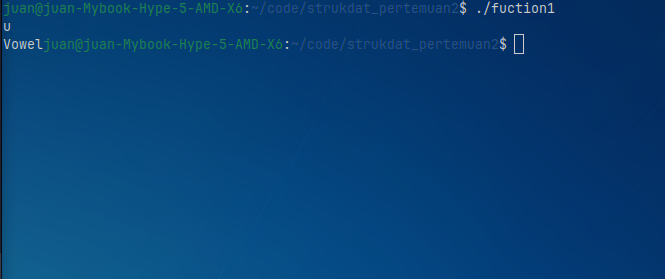
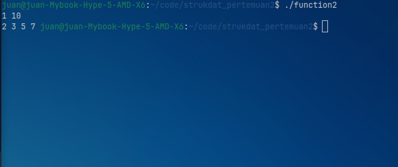
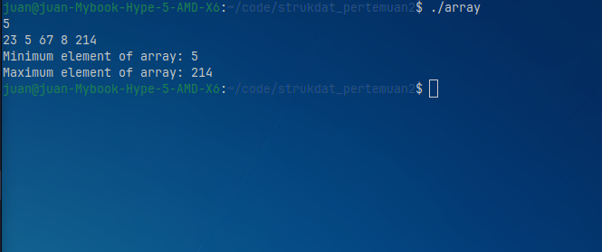
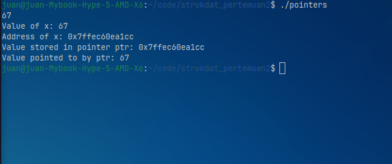
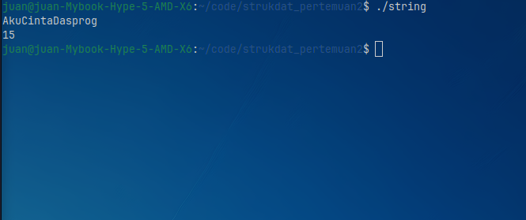

# Review Dasar-dasar C++

## Hello, World!
Program C++ paling dasar yang hanya menampilkan tulisan ke layar menggunakan cout. Program ini tidak menerima input dari pengguna..

**Kode**:
```cpp
#include <iostream>
using namespace std;

int main()
{
    cout << "Hello World!";
    return 0;
}
```

**Output**:



## Puts Name
Program ini menampilkan sebuah teks ke layar menggunakan fungsi puts(). Fungsi puts() berasal dari bahasa C dan digunakan untuk mencetak string diikuti baris baru.

**Kode**:
```cpp
#include <bits/stdc++.h>
using namespace std;

int main(){
    puts("Najwan Sigit Cahya Buana");
    return 0;
}
```

**Output**:



## Input dan Output
Program ini meminta pengguna memasukkan sebuah angka dan satu huruf melalui keyboard menggunakan cin. Setelah itu, program menampilkan kembali nilai yang dimasukkan menggunakan kombinasi puts() dan cout.

**Kode**:
```cpp
#include <bits/stdc++.h>
using namespace std;

int main() {
    int angka;
    cout << "Masukkan angka: ";
    cin >> angka;

    char huruf;
    cout << "Masukkan huruf: ";
    cin >> huruf;

    puts("Angka & huruf yang kamu input adalah: ");
    cout << angka << " & " << huruf << endl;

    return 0;
}
```

**Output**:




## Control Flow
Program ini membaca sebuah angka dari pengguna, lalu menggunakan percabangan if-else untuk menentukan apakah angka tersebut termasuk bilangan genap atau ganjil.

Jika angka habis dibagi 2 maka akan ditampilkan "Even", jika tidak maka ditampilkan "Odd".

**Kode**:
```cpp
#include <bits/stdc++.h>
using namespace std;

int main() {
    int n;
    cin >> n;

    if(n % 2 == 0) cout << "Even";
    else cout << "Odd";

    return 0;
}
```
**Output**:



## Loop
Program ini menggunakan perulangan bersarang (nested loop) untuk menampilkan pola angka berbentuk segitiga.

Jumlah baris pola ditentukan oleh input pengguna. Angka yang dicetak terus bertambah setiap kali dicetak.

**Kode**:
```cpp
#include <bits/stdc++.h>
using namespace std;

int main() {
    int row, column, n, num = 1;
    cin >> n;

    for(int row = 0; row <= n; row++) {
        for(int column = 0; column < row; column++) {
            cout << num++ << " ";
        }

        cout << "\n";
    }

    return 0;
}
```

**Output**:



## Function 1
Program ini menggunakan fungsi bernama check_letter untuk mengecek apakah huruf yang dimasukkan pengguna termasuk huruf vokal atau konsonan.

Fungsi akan membandingkan huruf input dengan daftar huruf vokal (a, i, u, e, o dalam huruf kecil maupun besar). Jika cocok maka ditampilkan "Vowel", jika tidak maka "Consonant".

**Kode**:
```cpp
#include <bits/stdc++.h>
using namespace std;

void check_letter(char x) {
    if(x == 'a' || x == 'i' || x == 'u' || x == 'e' || x == 'o'
    || x == 'A' || x == 'I' || x == 'U' || x == 'E' || x == 'O') {
        cout << "Vowel";
    }
    else cout << "Consonant";
}

int main() {
    char letter;
    cin >> letter;

    check_letter(letter);

    return 0;
}
```

**Output**:



## Function 2
Program ini menampilkan semua bilangan prima dalam rentang angka yang dimasukkan pengguna.

Terdapat dua fungsi:

-isPrime(n) → mengecek apakah sebuah angka merupakan bilangan prima
-findPrimes(left, right) → mencari semua bilangan prima dalam rentang

Jika tidak ada bilangan prima dalam rentang tersebut, program akan menampilkan pesan khusus.

**Kode**:
```cpp
#include <bits/stdc++.h>
using namespace std;

bool isPrime(int n) {
    if(n <= 1) return false;
    for(int i = 2; i < n; i++) {
        if(n % i == 0) return false;
    }

    return true;
}

void findPrimes(int left, int right) {
    bool found = false;
    for(int i = left; i <= right; i++) {
        if(isPrime(i)) {
            cout << i << " ";
            found = true;
        }
    }

    if(!found) cout << "No prime numbers found in the given range.";
}

int main() {
    int left, right;
    cin >> left >> right;

    findPrimes(left, right);

    return 0;
}
```

**Output**:



## Array
Program ini membaca sejumlah elemen array dari pengguna, kemudian mencari nilai terkecil dan terbesar.

Dua fungsi digunakan:
-getMin() untuk mencari nilai minimum
-getMax() untuk mencari nilai maksimum

Hasil akhirnya menampilkan nilai minimum dan maksimum dari array..

**Kode**:
```cpp
#include <bits/stdc++.h>
using namespace std;

getMin(int arr[], int n) {
    int res = arr[0];
    for(int i = 0; i < n; i++) res = min(res, arr[i]);

    return res;
}

getMax(int arr[], int n) {
    int res = arr[0];
    for(int i = 0; i < n; i++) res = max(res, arr[i]);

    return res;
}

int main() {
    int n;
    cin >> n;

    int arr[n];
    for(int i = 0; i < n; i++) cin >> arr[i];

    cout << "Minimum element of array: " << getMin(arr, n) << endl;
    cout << "Maximum element of array: " << getMax(arr, n) << endl;

    return 0;
}
```

**Output**:



## Pointers
Program ini menunjukkan cara kerja pointer pada C++.

Pointer ptr menyimpan alamat memori dari variabel var. Program kemudian menampilkan:

-nilai variabel
-alamat memori variabel
-alamat yang disimpan pointer
-nilai yang ditunjuk oleh pointer (dereference)

**Kode**:
```cpp
#include <bits/stdc++.h>
using namespace std;

int main() {
    int var;
    cin >> var;

    int *ptr = &var;

    cout << "Value of x: " << var << endl;
    cout << "Address of x: " << &var << endl;
    cout << "Value stored in pointer ptr: " << ptr << endl;
    cout << "Value pointed to by ptr: " << *ptr << endl;

    return 0;
}
```

**Output**:



## String
Program ini membaca sebuah kata atau teks dari pengguna ke dalam variabel string, lalu menampilkan jumlah karakter yang dimiliki string tersebut menggunakan fungsi .size().

**Kode**:
```cpp
#include <bits/stdc++.h>
using namespace std;

int main() {
    string str;
    cin >> str;

    cout << str.size() << endl;

    return 0;
}
```

**Output**:

